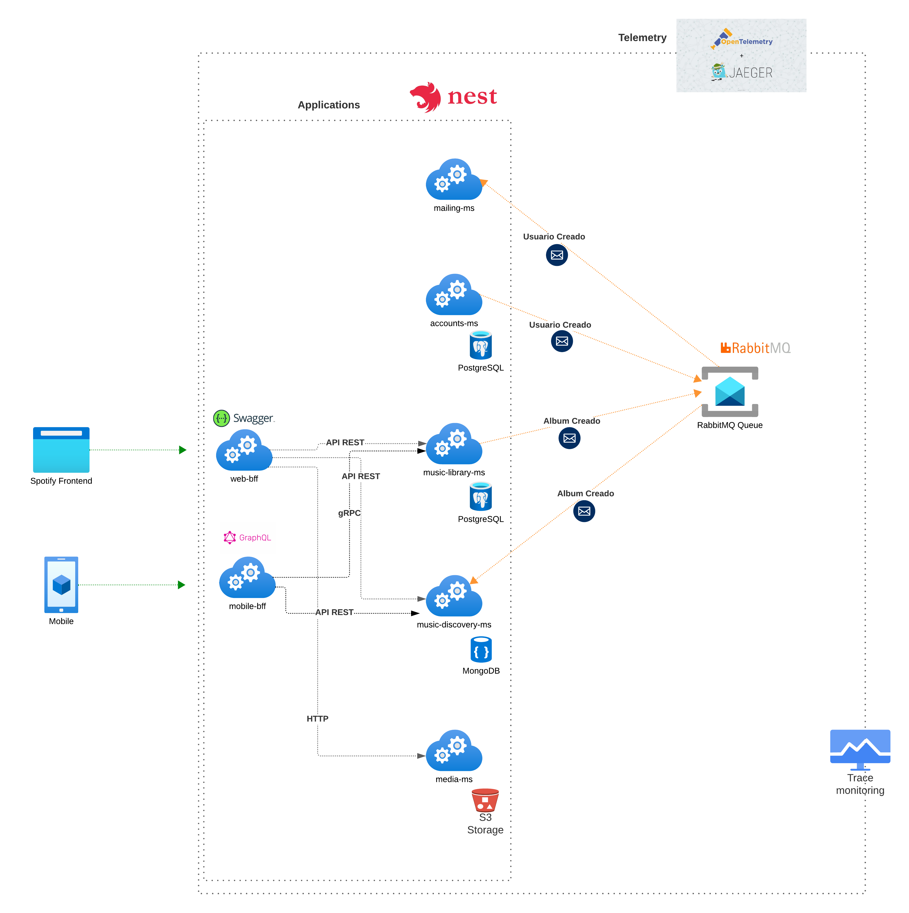
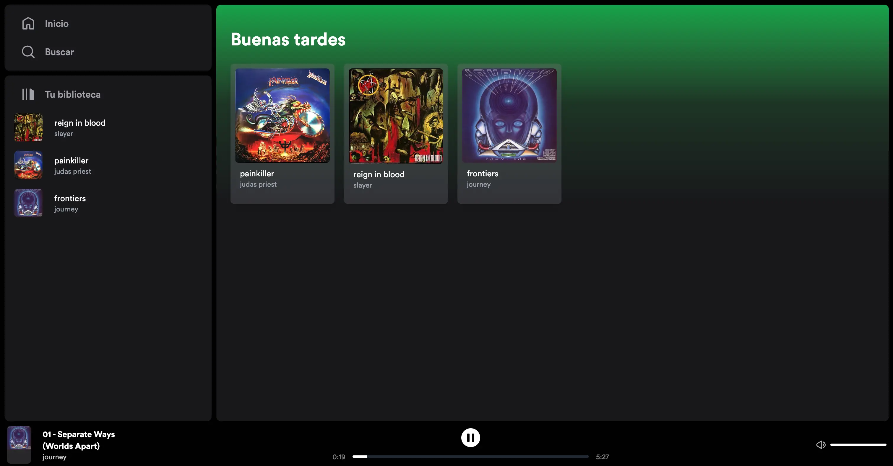

# Arquitectura de microservicios con Nestjs

Este repositorio tiene como objetivo proporcionar ejemplos y guías sobre cómo implementar patrones de arquitectura de microservicios utilizando NestJS. Está inspirado en la complejidad y desafíos que presenta una plataforma como Spotify. Crearemos un clon que emulará las funcionalidades mas comunes de la famosa plataforma de música. A través de este proyecto, podrás explorar las mejores prácticas, estructuras y conceptos clave para desarrollar aplicaciones escalables y mantenibles basadas en microservicios.

## Objetivo

El propósito principal de este proyecto es:

* Proporcionar ejemplos claros y detallados de cómo implementar patrones de arquitectura de microservicios utilizando NestJS.
* Presentar ejemplos prácticos que representen características clave de una plataforma de música, como la gestión de usuarios, autenticación, gestión de música y listas de reproducción.
* Facilitar un entorno de aprendizaje donde puedas comprender no solo los fundamentos de NestJS, sino también su aplicación práctica en un entorno de microservicios.

## Módulos de aprendizaje:x

* 1 - Diseño de aplicaciones
    * [Diseño de aplicaciones escalables y mantenibles](docs/how-to-build-scalable-and-maintainable-apps.md)
    * [Simplificando el testing unitario con arquitectura hexagonal](docs/easy-unit-testing-with-hexagonal.md)
    * [Simplificando el Testing e2e](docs/e2e-testing.md)
* 2 - Observabilidad
    * [Trazas distribuidas](docs/distributed-traces.md)
* 3 - Comunicaciones entre microservicios
    * [Comunicación entre microservicios](docs/microservices-communication.md)
    * [Comunicación síncrona avanzada](docs/advanced-sync-communication.md)
    * Comunicación asíncrona avanzada
        * [Eventos de dominio vs Eventos de integración](docs/domain-events-vs-integration-events.md)
        * Transacciones distribuidas con Sagas
* 4 - Exponiendo microservicios al cliente
* 5 - Seguridad en microservicios
* 6 - Patrones de resilencia
* 7 - Patrones de alto rendimiento
* **Work in progress...**

## Arquitectura de microservicios

El siguiente diagrama de arquitectura muestra los microservicios disponibles y las tecnologías utilizadas.



## Aplicaciones disponibles:

Todos los microservicios y componentes se describen acá:

* `spotify-monolith`: Aplicación monolítica clon de Spotify que gestiona usuarios, la librería de canciones y las listas de reproducción.
* `music-library-ms`: Microservicio que gestiona la librería musical de artistas, álbumes, canciones y géneros de nuestro clon de Spotify.
* `music-discovery-ms`: Microservicio que gestiona radios y listas de reproducción destinado a que el usuario conozca nueva música.
* `accounts-ms`: Microservicio que gestiona las cuentas de usuario.
* `mobile-bff`: Backend For Frontend para aplicación móvil, encargada de obtener la librería musical, las listas de reproducción y radios, y exponer los datos como API GraphQL.
* `web-bff`: Backend For Frontend para aplicación web integrada con una aplicación [basada en AstroJs](https://github.com/nullpointer-excelsior/spotify-clone-frontend). Este BFF se encarga de obtener la librería musical, las listas de reproducción y radios, y exponer los datos como API REST.
* `mailing-ms`: Microservicio encargado del envío de correos electrónicos.
* `media-ms`: Microservicio encargado de entregar los recursos de audio e imágenes relacionadas al catálogo musical.


## Tecnologías empleadas:

* `NestJs`: Framework Node.js con TypeScript.
* `Docker`: Plataforma para crear y ejecutar aplicaciones en contenedores.
* `Postgres`: Sistema de gestión de bases de datos relacional.
* `MongoDB`: Base de datos NoSQL orientada a documentos. 
* `RabbitMQ`: Broker de mensajes para la comunicación entre microservicios.
* `Redis`: Broker de mensajes para eventos de integración en memoria basados en un modelo de pub/sub
* `Minio Storage`: Servicio de administración para el almacenamiento de objetos compatible con S3.
* `OpenTelemetry`: Librería destinada a recolectar datos de telemetría y enviarlos al servidor OTLP configurado.
* `Jeager UI`: Servicio OTLP destinado a recolectar datos de telemetría de los microservicios y disponibilizar información de las trazas.

## Monorepositorio con NestJs

NestJs nos da una manera sencilla de crear monorepositorios donde con simples instrucciones podremos crear librerías compartidas o aplicaciones. Nos ayudaremos de esto para poder, para más información, consultar la documentación de [workspaces de NestJs](https://docs.nestjs.com/cli/monorepo).

## Estructura de directorios

La estructura de carpetas es la siguiente:

* `apps`: aplicaciones nestjs en nuestro caso serán nuestros microservicios.
* `libs`: librerías de uso compartido por los microservicios para reutilizar componentes.
* `infrastructure`: todo lo relacionado a la infraestructura necesaria para que nuestros microservicios puedan ser ejecutados.
* `docs`: documentación de patrones y técnicas utilizados en microservicios.
* `jobs`: jobs encargados de configuraciones o carga de datos iniciales.
* `scripts`: definición de bash scripts complejos que no se puedan manejar desde package.json

## Ejecución de aplicaciones

Puedes ejecutar un stack mínimo para poder visualizar una aplicación frontend robada de un [tutorial de midudev](https://www.youtube.com/watch?v=WRc8lz-bp78) y adaptada para poder conectarse con el stack de microservicios de Spotify-clone. También puedes levantar otros servicios para poder ver los ejemplos funcionando de cada artículo expuesto en este repositorio.

> Spotify clone frontend con AstroJs esta [acá](https://github.com/nullpointer-excelsior/spotify-clone-frontend)

## Instalación:

Asegúrate de tener:

* Node versión 18 o superior
* Docker
* python3


Instala las dependencias usando npm install.

```bash
#!/bin/bash
npm install
```

### Variables de entorno

Todas las aplicaciones, jobs e infraestructura son configuradas mediante variables de ambiente definidas en el archivo `.env` 

### Levantar infraestructura

Para levantar la infraestructura de base de datos, S3, telemetría y Broker de mensajería ejecuta el siguiente comando:

```bash
#!/bin/bash
npm run start:infra
```

### Levantar stack de ejemplo

Dependiendo del caso o ejemplo que estés viendo, puedes ejecutar una o más aplicaciones. Para levantar un stack básico con una aplicación cliente frontend, puedes levantar los siguientes servicios:

```bash
#!/bin/bash

# api catalogo de musica.
npm run start:music-library
# servidor de media para audio e imagenes.
npm run start:media-ms
# backend for frontend encargado de consolidar todos los endpoints de microservicios en 1 solo punto de entrada para las aplicaciones cliente.
npm run start:web-bff
# frontend spotify de ejemplo
npm run start:frontend
```

### Cargar catálogo musical

Para cargar el catálogo de música de ejemplo, deberás ejecutar el script `jobs/create_music_library.py`

```bash
#!/bin/bash


pip install -r jobs/requirements.txt

python jobs/create_music_library.py

```

Ahora deberías tener ejecutándose en http://localhost:4321/ el frontend de Clon-spotify con un catálogo musical de ejemplo.



## Purebas unitarias y E2E

puedes ejecutar las pruebas unitarias con:

```bash
#!/bin/bash
npm run test
```
Y ejecutar las pruebas e2e de la siguiente manera:

```bash
#!/bin/bash

# levanta infra destinada a pruebas e2e
npm run start:e2e-infra

# ejecuta todas las pruebas e2e de la arquitectura de microservicios
npm run e2e:all

```
Tambien puedes ejecutar las pruebas e2e de forma separada por cada microservicio

```bash
#!/bin/bash

npm run e2e:music-library

npm run e2e:music-discovery

npm run e2e:mobile-bff

```
### Detener infraestructura

Si deseas terminar con la infraestructura, tienes disponibles los siguientes comandos:

```bash
#!/bin/bash

# detiene la infraestructura principal de microservicios
npm run stop:infra
# detiene la infraestructura de pruebas e2e
npm run stop:e2e-infra

```

Para ejecutar los componentes del proyecto de forma individual, tienes disponibles los siguientes scripts:

```bash
# Instala las dependencias usando npm install.
npm install

# Formatear Código
npm run format

# Iniciar Infraestructura (Docker Compose)
npm run start:infra

# Detener Infraestructura (Docker Compose)
npm run stop:infra

# Iniciar Infraestructura de Pruebas de Extremo a Extremo
npm run start:e2e-infra

# Detener Infraestructura de Pruebas de Extremo a Extremo
npm run stop:e2e-infra

# Iniciar Componentes Individuales:

## Monolito de Spotify
npm run start:spotify-monolith

## Biblioteca de Música
npm run start:music-library

## Descubrimiento Musical
npm run start:discovery

## Cuentas
npm run start:accounts

## BFF Móvil
npm run start:mobile-bff

## BFF Web
npm run start:web-bff

## Servicio de Correo
npm run start:mailing

## Media server
npm run start:media

# Ejecutar Pruebas Unitarias de todas las aplicaciones

npm test

# Ejecutar Pruebas de Extremo a Extremo

## Monolito de Spotify
npm run e2e:monolith

## Biblioteca de Música
npm run e2e:music-library

## BFF Móvil
npm run e2e:mobile-bff

## Descubrimiento Musical
npm run e2e:music-discovery

## Todos las pruebas unitarias
npm run e2e:all

# Linting
npm run lint

```

## Recursos adicionales

* [Documentación oficial de NestJS](https://docs.nestjs.com/)
* [Documentación de patrones de microservicios](https://microservices.io/patterns/index.html)

### Desarrollado por Benjamín