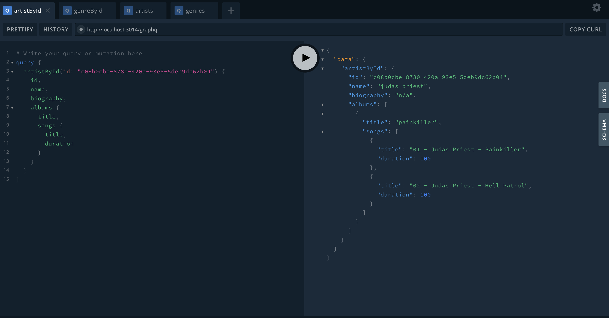

# Comunicación sincrona avanzada en Microservicios.

En una arquitectura de microservicios, podemos comunicar nuestras aplicaciones de forma síncrona y asíncrona. En este artículo, exploraremos comunicaciones síncronas avanzadas. Si bien RESTful es la manera más sencilla de comunicarnos con un microservicio, la eficiencia y flexibilidad en las comunicaciones entre servicios son fundamentales. Dos tecnologías que han revolucionado esta área son gRPC y GraphQL. Estas herramientas ofrecen enfoques distintos pero potentes para manejar las comunicaciones entre microservicios, cada una con sus propias ventajas y casos de uso.


## gRPC para comunicaciones eficientes.

### ¿Qué es gRPC?

gRPC es un framework de comunicación de código abierto desarrollado por Google. Utiliza el protocolo HTTP/2 para la comunicación de datos de forma eficiente, permitiendo a los desarrolladores definir sus servicios mediante el lenguaje de definición de interfaz (IDL) Protocol Buffers. Esta tecnología está diseñada para ser rápida, eficiente y escalable, ideal para entornos distribuidos.

### Ventajas de gRPC:

- **Rendimiento**: Utiliza HTTP/2, lo que permite la multiplexación de solicitudes, minimizando la latencia y mejorando el rendimiento.
- **Tipado fuerte**: Gracias a Protocol Buffers, ofrece un sistema de tipos fuertemente tipado que facilita la definición y validación de datos.
- **Bidireccional y streaming**: Admite la comunicación bidireccional y transmisión de datos en tiempo real mediante streaming, lo que lo hace adecuado para aplicaciones con necesidades de actualización constante de datos, como chats o sistemas de seguimiento en tiempo real.

### Desventajas de gRPC:

- **Complejidad de implementación**: La curva de aprendizaje inicial puede ser pronunciada, especialmente para equipos que no están familiarizados con Protocol Buffers o el paradigma de comunicación basado en RPC (Remote Procedure Call).

- **Problemas de visibilidad y debugging**: Al utilizar un formato binario para la transferencia de datos, puede ser más difícil depurar y visualizar los datos transmitidos en comparación con formatos de texto utilizados en otros protocolos, como REST.

- **Restricciones en la interoperabilidad**: Aunque gRPC es altamente eficiente dentro de su ecosistema, puede haber limitaciones al interactuar con sistemas que no admiten o tienen dificultades para integrarse con HTTP/2 o Protocol Buffers.

## Implementando gRPC con NestJs

NestJs nos provee una manera sencilla de implementar un servicio con gRPC. Si bien tendremos que saber cómo implementar el archivo `.proto`, lo demás será sencillo. En el siguiente ejemplo, basado en el stack de microservicios de Spotify-clone, analizaremos la comunicación de una aplicación de tipo backend-for-frontend llamada `mobile-bff`, que se comunicará con el microservicio `music-library-ms`, el cual provee el catálogo musical.

Este ejemplo es bastante cercano a la realidad, ya que una aplicación móvil necesita mayor eficiencia en las conexiones. Cuando las aplicaciones móviles se conecten a un servidor backend donde sus servicios internos utilicen gRPC, ayudará a reducir la latencia y el tráfico de red entre un servicio y otro, resultando en una mejor respuesta del lado del cliente.

### Definiendo el contrato con un archivo .proto

Este será nuestro contrato. Este archivo debe ser el mismo para todos los servicios que utilicen gRPC.

```proto
// libs/music-library-grpc/src/music-catalog.proto
syntax = "proto3";

package catalog;

// Importa los paquetes necesarios
import "google/protobuf/empty.proto";
import "google/protobuf/wrappers.proto";

message ID {
    string id = 1;
}

message Album {
    string id = 1;
    string title = 2;
    string photo = 3;
    int32 year = 4;
}

message Artist {
    string id = 1;
    string name = 2;
    string photo = 3;
    string biography = 4;
}

message Genre {
    string id = 1;
    string name = 2;
}

message Song {
    string id = 1;
    string title = 2;
    string video = 3;
    int32 plays = 4;
    int32 duration = 5;
    string artist_id = 6;
    string album_id = 7;
    string genre_id = 8;
}

service ArtistService {
    rpc GetAllArtists(google.protobuf.Empty) returns (stream Artist);
    rpc GetArtistById(ID) returns (Artist);
}

service AlbumService {
    rpc GetAllAlbums(google.protobuf.Empty) returns (stream Album);
    rpc GetAlbumById(ID) returns (Album);
    rpc GetAlbumsByArtistId(ID) returns (stream Album);
}

service SongService {
    rpc GetAllSongs(google.protobuf.Empty) returns (stream Song);
    rpc GetSongById(ID) returns (Song);
    rpc GetSongsByIds(stream ID) returns (stream Song);
    rpc GetSongsByArtistId(ID) returns (stream Song);
    rpc GetSongsByAlbumId(ID) returns (stream Song);
    rpc GetSongsByGenreId(ID) returns (stream Song);
}

service GenreService {
    rpc GetAllGenres(google.protobuf.Empty) returns (stream Genre);
    rpc GetGenreById(ID) returns (Genre);
}
```

Básicamente, aquí tendremos:

- `messages`: son la estructura de datos que intercambiaremos entre los servicios
- `services`: son las operaciones disponibles 


El servicio `music-library-ms` expondrá los servicios mediante la anotación `@Controller`. NestJS sabrá que este controlador corresponde a un endpoint gRPC, ya que configuraremos nuestra aplicación como microservicio.

```typescript
//apps/music-library-ms/src/main.ts
app.connectMicroservice({
  transport: Transport.GRPC,
  options: {
    package: 'catalog',
    protoPath: join(__dirname, 'music-catalog.proto'),
  },
})
await app.startAllMicroservices()
```

Nuestro controlador expondrá los servicios.

```typescript
// apps/music-library-ms/src/music-catalog/infrastructure/grpc/catalog.controller.ts
@Controller()
export class CatalogController {

  constructor(private catalog: CatalogUseCases) { }

  @GrpcMethod('ArtistService', 'GetAllArtists')
  getAllArtists(data: any, metadata: Metadata, call: ServerUnaryCall<any, any>): Observable<Artist> {
      return this.catalog.findAllArtists()
  }

  @GrpcMethod('ArtistService', 'GetArtistById')
  getArtistById(data: ID, metadata: Metadata, call: ServerUnaryCall<any, any>): Observable<Artist> {
      return this.catalog.findArtistById(data.id)
  }
    // other implementations of CatalogUseCases

}
```
> La clase `CatalogUseCases` tendrá lógica para obtener el catálogo musical.

Básicamente, tendremos nuestro servidor gRPC listo. Ahora definiremos el cliente en la aplicación `mobile-bff`:

```typescript
// apps/mobile-bff/src/mobile-bff.module.ts
@Module({
  imports: [
    ClientsModule.register([
      {
        name: 'MUSIC_CATALOG_PACKAGE',
        transport: Transport.GRPC,
        options: {
          package: 'catalog',
          protoPath: join(__dirname, 'music-catalog.proto'),
        },
      },
    ]),
  ],
  providers: [
    MusicCatalogClient
  ],
  exports: [
    MusicCatalogClient
  ]
  
})
export class MusicLibraryGrpcModule {}
```

Definimos nuestro cliente gRPC con el módulo `ClientModule`. Ahora, basados en el archivo `.proto` que definimos anteriormente, creamos el modelo en código con TypeScript.

```typescript
// libs/music-library-grpc/messages.ts

export interface ID {
  id: string;
}

export interface Album {
  id: string;
    title: string;
    photo: string;
    year: number;
}

export interface Artist {
  id: string;
    name: string;
    photo: string;
    biography: string;
}

export interface Genre {
  id: string;
    name: string;
}

export interface Song {
  id: string;
    title: string;
    video: string;
    plays: number;
    duration: number;
    artist_id: string;
    album_id: string;
    genre_id: string;
}

// libs/music-library-grpc/services.ts
export interface ArtistService {
    GetAllArtists({}): Observable<Artist>;
    GetArtistById(request: ID): Observable<Artist>;
}

export interface AlbumService {
    GetAllAlbums({}): Observable<Album>;
    GetAlbumById(request: ID): Observable<Album>;
    GetAlbumsByArtistId(request: ID): Observable<Album>;
}

export interface SongService { 
    GetAllSongs({}): Observable<Song[]>;
    GetSongById(request: ID): Observable<Song>;
    GetSongsByIds(request: ID[]): Observable<Song>;
    GetSongsByArtistId(request: ID): Observable<Song>;
    GetSongsByAlbumId(request: ID): Observable<Song>;
    GetSongsByGenreId(request: ID): Observable<Song>;
 }

export interface GenreService {
    GetAllGenres({}): Observable<Genre>;
    GetGenreById(request: ID): Observable<Genre>;
}
```

Para instanciar los servicios de gRPC, debemos crear estos componentes de la siguiente manera:

```typescript
// libs/music-library-grpc/music-catalog.client.ts
@Injectable()
export class MusicCatalogClient implements OnModuleInit {

    private artistService: ArtistService;
    private albumService: AlbumService;
    private songService: SongService;
    private genreService: GenreService;
    
    constructor(@Inject('MUSIC_CATALOG_PACKAGE') private client: ClientGrpc) { }

    onModuleInit() {
        this.artistService = this.client.getService<ArtistService>('ArtistService');
        this.albumService = this.client.getService<AlbumService>('AlbumService');
        this.songService = this.client.getService<SongService>('SongService');
        this.genreService = this.client.getService<GenreService>('GenreService');
    }

    findAllArtists() {
        return this.artistService.GetAllArtists({});
    }
    // ... other methods
}
```

De esta forma, la clase `MusicCatalogClient` implementará un `Facade` para exponer los servicios. Finalmente, podemos importar nuestro módulo en la aplicación `mobile-bff`.

```typescript
// apps/mobile-bff/src/mobile-bff.module.ts
@Module({
  imports: [
    MusicLibraryGrpcModule,
    // other modules
  ],
})
export class MobileBffModule { }
```

Ahota podremos usar nuestro cliente gRPC.

```typescript
@Injectable()
export class SomeService {
    constructor(private grpc: MusicCatalogClient) {}
}
```

## GraphQL: Poderoso lenguaje de consulta

### ¿Qué es GraphQL?

GraphQL es un lenguaje de consulta y manipulación de datos desarrollado por Facebook. A diferencia de las API REST tradicionales, donde los clientes reciben datos predefinidos, GraphQL permite a los clientes solicitar solo los datos que necesitan, lo que lo hace altamente flexible y eficiente en términos de consumo de recursos.

### Grapql  y su Lenguaje de consulta

GraphQL en sí mismo es un lenguaje de consulta y manipulación de datos que permite a los clientes definir la estructura de los datos que desean recibir. Esto se hace mediante la construcción de consultas GraphQL, que especifican los campos exactos que el cliente necesita de los servicios o APIs.

El lenguaje de consulta de GraphQL tiene una sintaxis específica para construir estas consultas. Aquí hay un ejemplo básico de cómo se vería una consulta GraphQL:

```gql
query {
  user(id: 123) {
    name
    email
    posts {
      title
      content
    }
  }
}
```
En esta consulta, se está pidiendo información sobre un usuario específico por su ID, solicitando el nombre, el correo electrónico y los títulos y contenidos de sus publicaciones.

Las consultas GraphQL son flexibles y permiten anidar campos y especificar relaciones entre ellos de manera muy estructurada. Además de las consultas, GraphQL también admite otras operaciones, como mutaciones para la modificación de datos y suscripciones para establecer canales de comunicación en tiempo real.


### El Playground de consultas

A su vez, GraphQL, al levantar un servicio, nos permite acceder a un playground donde podremos realizar consultas y mutaciones. También tendremos la documentación autogenerada en base anuestro código de qué consultas, mutaciones y suscripciones podremos realizar.

### Ventajas de GraphQL:

- **Solicitudes precisas de datos**: Permite a los clientes solicitar solo la información necesaria mediante consultas específicas.

- **Flexibilidad en consultas**: Los clientes pueden definir la estructura exacta de los datos que desean recibir, permitiendo anidamiento de campos y especificación de relaciones entre ellos de manera más flexible y estructurada.

- **Reducción del número de solicitudes**: Al poder solicitar múltiples recursos a través de una sola consulta, se reduce la necesidad de realizar múltiples solicitudes al servidor.

- **Herramientas de desarrollo robustas**: Cuenta con herramientas de desarrollo sólidas, como GraphiQL, que facilitan la exploración del esquema y la construcción de consultas.

### Desventajas de GraphQL:
- **Curva de aprendizaje inicial**: Para aquellos nuevos en GraphQL, puede requerir tiempo comprender su sintaxis y las mejores prácticas para el diseño del esquema.

- **Cacheo y caché compartido**: La complejidad de las consultas personalizadas puede dificultar el cacheo efectivo de consultas, aunque herramientas como Apollo Client ofrecen soluciones para mitigar este problema.

- **Posible ineficiencia en consultas anidadas**: Consultas profundamente anidadas o complejas pueden dar lugar a consultas excesivamente pesadas que requieren una gestión cuidadosa para garantizar el rendimiento del servidor.

- **Carga de trabajo en el servidor**: Una mala gestión de consultas complejas o maliciosas podría aumentar la carga en el servidor, especialmente si no se implementan medidas adecuadas de seguridad y control de consultas.

## Implementando un servidor GraphQL.

Ahora implementaremos un ejemplo de GraphQL siguiendo el mismo ejemplo anterior. Configuraremos nuestra aplicación `mobile-bff` como un servidor GraphQL que consume el microservicio `music-library-ms` con gRPC.

Para crear un servidor GraphQL debemos crear los siguientes componentes:

- `Tipos y campos`: modelo de datos donde definimos nuestros modelos y sus propiedades 
- `Queries`: estructura de las operaciones de lectura sobre GraphQL
- `Resolvers`: son los servicios que devolverán o realizarán las operaciones definidas en el modelo GraphQL.

Nestjs nos permite usar decoradores para realizar el modelo. Sin embargo, también es posible crear un archivo `.gql`, el cual representará el modelo GraphQL, pero en ese caso debemos implementar el mapeo de las operaciones y los objetos.

En nuestro ejemplo, solo habrá operaciones de lectura, es decir, queries, y utilizaremos decoradores.

Definimos nuestro módulo `mobile-bff.module`.

```typescript
// apps/mobile-bff/src/mobile-bff.module.ts
@Module({
  imports: [
    ConfigModule.forRoot(),
    GraphQLModule.forRoot<ApolloDriverConfig>({
      driver: ApolloDriver,
      autoSchemaFile: join(process.cwd(), 'apps/mobile-bff/schema.gql'),
    }),
    MusicLibraryGrpcModule,
  ],
  providers: [
    ArtistResolver,
    AlbumResolver,
    GenreResolver,
    SongResolver,
    RadioResolver,
  ],
})
export class MobileBffModule { }
```
Ahora definimos nuestro modelo de datos.

```typescript
// apps/mobile-bff/src/music-catalog/graphql/models/artist.model.ts
@ObjectType()
export class Artist {

    @Field({ nullable: true })
    id: string;

    @Field()
    name: string;
    
    @Field({ nullable: true })
    photo?: string;

    @Field({ nullable: true })
    biography?: string;

    @Field(type =>[Album], { nullable: 'itemsAndList' })
    albums?: Album[]
  
}
```

Definiremos nuestra clase resolver.

```typescript
// apps/mobile-bff/src/music-catalog/graphql/resolvers/artist.resolver.ts
@Resolver(of => Artist)
export class ArtistResolver {

    constructor(private grpc: MusicCatalogClient) {}

    @Query(returns => Artist)
    artistById(@Args('id') id: string) {
        return this.grpc.findArtistById(id)
    }

    @Query(returns => [Artist])
    artists() {
        return this.grpc.findAllArtists().pipe(toArray())
    }

    @ResolveField()
    async albums(@Parent() artist: Artist) {
        return this.grpc.findAlbumsByArtistId(artist.id).pipe(toArray())
    }
    
}
```
Finalmente podremos probar nuestro ejemplo de nuestro repositorio de la siguiente manera:

```bash
#!/bin/bash

# levanta la infraestructura
npm run start:infra
# levanta nuestro catalog musical con el servidor gRPC activo
npm run start:music-library
# levanta el backend for frontend el cual actua como cliente gRPC y servidor GraphQL
npm run start:mobile-bff

```
Ahora puedes realizar consultas en el playground en la URL: http://localhost:3014/graphql.




## Conclusión

Establecer una comunicación entre microservicios no solo se basa en el popular enfoque de APIs REST. En esta ocasión destacamos gRPC y GraphQL, con sus casos de uso correspondientes. Definir la estrategia adecuada nos ayudará a crear sistemas que cumplan de mejor manera requerimientos avanzados en proyectos basados en microservicios.