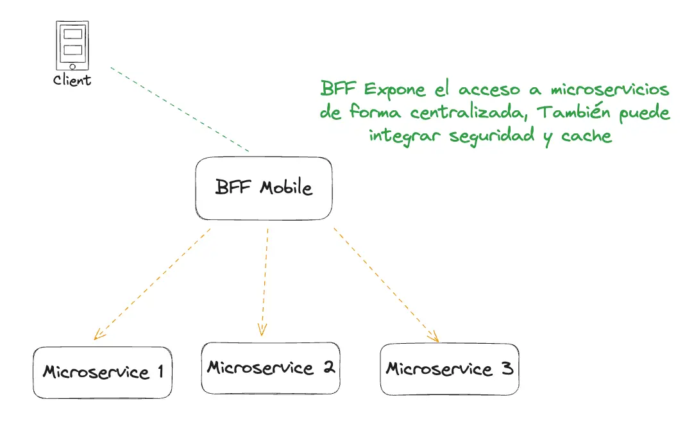
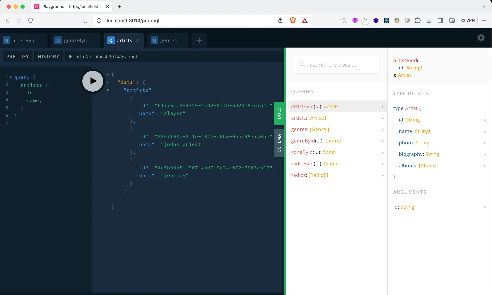

# Backend for Frontend Pattern

Cuando optamos por una arquitectura basada en microservicios, hemos dividido un sistema complejo en pequeñas partes independientes y con responsabilidades definidas. A su vez, surge la necesidad de gestionar el acceso y consumo de los microservicios que hemos desarrollado. Para lograrlo, podemos hacer uso del patrón BFF (Backend for Frontend). La idea es similar a la de un api gateway, un componente central encargado de gestionar las peticiones de los clientes y redireccionar la petición al servicio adecuado. La gran diferencia es que BFF es una aplicación específica para una aplicación cliente, como puede ser un frontend, aplicación móvil u otro tipo de cliente.

## Tipos de BFF

Existen 2 tipos principales de BFF:

- `BFF específico por dispositivo`: se construye una aplicación BFF por tipo de dispositivo, generalmente uno para una versión web y otro para una versión móvil.
- `BFF por dominio`: se centra en construir un BFF por funcionalidad. Por ejemplo, un BFF para ventas, otro para usuarios, otro para clientes, etc.

## Ejemplo e implementación tecnológica de BFF por dispositivo

Tomaremos un ejemplo de implementación de BFF basado en nuestra querida arquitectura de clone spotify.

### En contexto

Nuestro spotify-clone tiene 2 clientes disponibles: web y mobile. Ambas aplicaciones están definidas para un cliente específico, ya que cada tipo de cliente tiene diferentes requerimientos. Por ejemplo, una aplicación móvil tendrá que lidiar con problemas de latencia y también tendrá muchas más funcionalidades que una aplicación versión web. Por lo tanto, el diseño de la API del BFF mobile debería poder ofrecer un alto nivel de flexibilidad. Por otro lado, nuestra BFF versión web no tendrá que lidiar con problemas de latencia tan frecuentemente como la versión móvil, y la cantidad de funcionalidades puede diferir en comparación con la versión mobile. Para construir nuestros BFFs, optaremos por 2 tecnologías distintas:

- `web-bff`: Aplicación backend basada en RESTful.
- `mobile-bff`: Aplicación backend basada en GraphQL.

## GraphQL vs RESTful

GraphQL es una tecnología que permite a los clientes especificar exactamente qué datos necesitan en una única solicitud y devuelve respuestas estructuradas según lo solicitado, utilizando normalmente un único endpoint. Por otro lado, una API RESTful utiliza múltiples endpoints con estructuras de datos fijas y a menudo requiere múltiples solicitudes para obtener toda la información necesaria, lo que puede ser menos eficiente en la red.

GraphQL es ideal para las necesidades de la aplicación BFF-mobile, mientras que una API RESTful es suficiente para bff-web dentro del contexto de `spotify-clone`.

## Construyendo un BFF

Al construir un BFF, definiremos la estructura de las peticiones y respuestas. A menudo, un BFF realiza múltiples peticiones a microservicios y agrupa las respuestas en una sola para devolverla al cliente. Un BFF no debería manejar ninguna lógica de negocio más que saber qué servicio llamar y cómo devolver las respuestas. A su vez, un BFF puede centralizar la autenticación, autorización y caché.



## Código de ejemplo

NestJs nos permite integrar GraphQL de forma sencilla, ya que podemos definir el modelo de las queries, mutaciones y suscripciones mediante anotaciones.

Explicaré brevemente las partes de GraphQL para mostrar la idea.

### Modelo

Definimos el modelo de la entidad que queremos exponer. A su vez, este modelo puede exponer otros modelos mediante propiedades. Hacemos uso de decoradores para poder definir el esquema de nuestra API GraphQL.

```typescript
import { Field, ObjectType } from '@nestjs/graphql';
import { Album } from './album.model';

@ObjectType()
export class Artist {

    @Field({ nullable: true })
    id: string;

    @Field()
    name: string;
    
    @Field({ nullable: true })
    photo?: string;

    @Field({ nullable: true })
    biography?: string;

    // eslint-disable-next-line @typescript-eslint/no-unused-vars
    @Field(type =>[Album], { nullable: 'itemsAndList' })
    albums?: Album[]
  
}
```

### Resolvers

Los resolvers son un componente que le dice a GraphQL cómo debe obtener los datos que les son solicitados. NestJs nos provee más decoradores para poder definir el esquema de datos de nuestra API GraphQL.

```typescript
@Resolver(of => Artist)
export class ArtistResolver {

    constructor(private grpc: MusicCatalogClient) {}

    @Span("ArtistResolver/query/artistById")
    @Query(returns => Artist)
    artistById(@Args('id') id: string) {
        return this.grpc.findArtistById(id)
    }

    @Span("ArtistResolver/query/artists")
    @Query(returns => [Artist])
    artists() {
        return this.grpc.findAllArtists().pipe(toArray())
    }

    @Span("ArtistResolver/field/album")
    @ResolveField()
    async albums(@Parent() artist: Artist) {
        return this.grpc.findAlbumsByArtistId(artist.id).pipe(toArray())
    }
    
}
```

### API Client

En este caso, hacemos uso de un servicio de gRPC para obtener los datos. También podemos hacer llamados a APIs REST dependiendo de la API que necesitemos consumir.

```typescript
@Injectable()
export class MusicCatalogClient implements OnModuleInit {

    private artistService: ArtistService;
    private albumService: AlbumService;
    private songService: SongService;
    private genreService: GenreService;
    
    constructor(@Inject('MUSIC_CATALOG_PACKAGE') private client: ClientGrpc) { }

    onModuleInit() {
        this.artistService = this.client.getService<ArtistService>('ArtistService');
        this.albumService = this.client.getService<AlbumService>('AlbumService');
        this.songService = this.client.getService<SongService>('SongService');
        this.genreService = this.client.getService<GenreService>('GenreService');
    }

    findAllArtists() {
        return this.artistService.GetAllArtists({});
    }

    findArtistById(id: string) {
        return this.artistService.GetArtistById({ id })
    }   

    findAllAlbums() {
        return this.albumService.GetAllAlbums({});
    }

    findAlbumById(id: string) {
        return this.albumService.GetAlbumById({ id });
    }

    findAlbumsByArtistId(id: string) {
        return this.albumService.GetAlbumsByArtistId({ id });
    }   

    findAllSongs() {
        return this.songService.GetAllSongs({});
    }

    findSongById(id: string) {
     return this.songService.GetSongById({ id });
    }

    findSongsByIds(ids: string[]) {
        return this.songService.GetSongsByIds(ids.map(id => ({ id })));
    }

    findSongsByArtistId(id: string) {
        return this.songService.GetSongsByArtistId({ id });
    }
    
    findSongsByAlbumId(id: string) {
        return this.songService.GetSongsByAlbumId({ id });
    }

    findSongsByGenreId(id: string) {
        return this.songService.GetSongsByGenreId({ id });
    }

    findAllGenres() {
        return this.genreService.GetAllGenres({});
    }

    findGenreById(id: string) {
        return this.genreService.GetGenreById({ id });
    }

}
```

Hacemos definición de los módulos para que NestJs pueda iniciar la aplicación.

```typescript
@Module({
  imports: [
    ConfigModule.forRoot(),
    GraphQLModule.forRoot<ApolloDriverConfig>({
      driver: ApolloDriver,
      autoSchemaFile: join(process.cwd(), 'apps/mobile-bff/schema.gql'),
    }),
    MusicLibraryGrpcModule,
    MusicLibraryApiModule,
    MusicDiscoveryApiModule,
    MusciPlayerModule
  ],
  providers: [
    ArtistResolver,
    AlbumResolver,
    GenreResolver,
    SongResolver,
    RadioResolver,
  ],
})
export class MobileBffModule { }
```

Para probar la API, inicia los siguientes servicios.

```bash
npm run start:infra
npm run job:create-music-library
npm run start:music-library
npm run start:discovery
npm run start:media
npm run start:mobile-bff
```

Puedes dirigirte a http://localhost:3014/graphql y visualizar una Playground que nos provee GraphQL por defecto, donde podrás consultar el esquema de la API y realizar consultas.



## Conclusiones

BFF nos permite centralizar el acceso a microservicios en un solo punto de entrada para las aplicaciones cliente. Dependiendo de las necesidades, tenemos disponibles distintas tecnologías para la comunicación, tanto para la comunicación de cliente a BFF como de BFF a microservicios. Como vimos en este ejemplo, GraphQL define una estructura de consulta eficiente para aplicaciones cliente móviles. La elección de la tecnología que expondremos al cliente dependerá del contexto. Lo importante es que mediante BFF podamos centralizar las peticiones a los microservicios en un único punto y podamos exponer de forma sencilla nuestro sistema.

