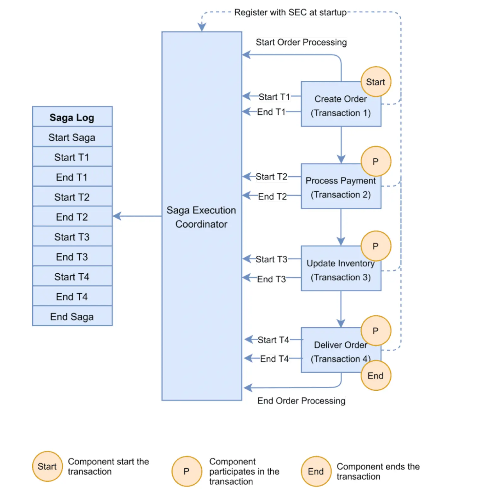
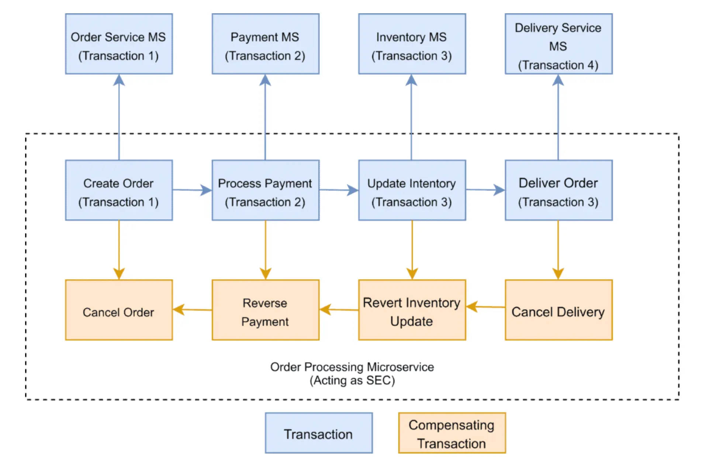

# 1 - Transacciones Distribuidas Con Patrones Saga

## Transacciones centralizadas vs distribuidas

Las aplicaciones monolíticas tienen la ventaja de poder crear procesos transaccionales de forma sencilla. Las transacciones nos ayudan a mantener la consistencia de los datos en operaciones de escritura.

Ya que podemos iniciar un conjunto de operaciones y, si son exitosas, persistir los cambios. Si algún error ocurre, realizaremos un rollback, el cual volverá a dejar en un estado consistente la base de datos antes de haber intentado una operación de escritura.

Si bien las bases de datos relacionales nos permiten esto de forma sencilla, en las arquitecturas de microservicio los procesos transaccionales son complejos, ya que no existe manera de centralizar las operaciones de escritura.

Para lograr transacciones en microservicios o sistemas distribuidos, podemos aprender de los patrones SAGA. Estos nos ayudarán a lidiar con sistemas distribuidos complejos donde involucran transacciones.

## Que son las SAGAS

El patrón SAGA (también conocido como patrón de transacción SAGA) es un patrón de diseño utilizado en arquitecturas de microservicios para manejar transacciones distribuidas. Su objetivo es mantener la consistencia de los datos en sistemas distribuidos donde múltiples servicios están involucrados en una transacción.

En lugar de utilizar una transacción monolítica que involucre a todos los servicios y que pueda causar bloqueos y cuellos de botella, el patrón SAGA divide la transacción en pasos más pequeños o secuencias de acciones. Cada paso se ejecuta como una transacción independiente en el contexto de un servicio específico. Estos pasos se organizan en una secuencia lógica y se ejecutan de manera secuencial o en paralelo.

El patrón SAGA utiliza dos estrategias principales para mantener la consistencia:

- **SAGA Orquestada:** Un componente central (orquestador) coordina y dirige la ejecución de los pasos de la transacción. Este orquestador envía comandos a los servicios involucrados para realizar las operaciones necesarias. Si un paso falla, el orquestador puede desencadenar acciones de compensación para revertir los cambios realizados en pasos anteriores.

- **SAGA Coreografía:** En este enfoque, no hay un orquestador central. En cambio, cada servicio conoce las acciones que debe realizar y cómo responder ante eventos. Cada servicio inicia sus propias transacciones y envía eventos para desencadenar las acciones en otros servicios. Este enfoque puede ser más complejo de diseñar y mantener, pero puede ser más escalable y distribuido.

## Diseñando una Saga

Orquestado o coreográfico, independientemente de cuál sea, debemos definir lo siguiente:

- Rransacciones o pasos
- Operaciones del servicio que realiza la transacción
- Comunicación entre servicios

Cuando creamos un proceso basado en sagas, definiremos los pasos. Estos serán las invocaciones a las operaciones de las aplicaciones involucradas.

### Proceso de compra basado en sagas

Diseñaremos un proceso de compra para un usuario basado en la adquisición de mercadería de las bandas de nuestro clon de Spotify. Entonces, estos son los pasos:

- **create-order:** encargado de crear una nueva orden en el sistema.
- **create-payment:** encargado de procesar un nuevo pago en el sistema.
- **update-stock:** encargado de actualizar el inventario de productos en el sistema.
- **create-delivery:** encargado de crear una nueva entrega en el sistema.
- **notify-purchase:** notificación al usuario de su compra

Cada paso definido se refiere a una operación en un microservicio. Cada operación puede ser síncrona o asíncrona, pero normalmente en una saga coreográfica debería ser asíncrona utilizando alguna estrategia de mensajería distribuida como RabbitMQ o Kafka.


### Operaciones de las sagas

Cada paso de nuestra saga debe definir los siguientes componentes:

- **Transacción:** la operación que realiza el microservicio. Esta debe devolver una respuesta exitosa o un error.
- **Compensación:** es la operación que actuará como un rollback, debe dejar el estado de los datos en la condición previa a la transacción realizada.
- **Respuesta ok de transacción:** indica que la transacción fue realizada exitosamente.
- **Error en transacción:** indica que la transacción falló, se deberá ver qué operaciones de compensación deben realizarse en este punto.

Definiendo este contrato podremos coordinar nuestro proceso de manera uniforme a través de los servicios involucrados. Debemos tener en cuenta que las operaciones de inicio y término pueden diferir en la implementación de estos contratos, pero todos los procesos fuera de las operaciones de inicio y término deben cumplir este contrato.

Para implementar de forma sencilla esto podemos hacer uso de un enum de typescript.

```typescript
export enum CreateNotificationSaga {
    TRANSACTION = 'send-notification-transaction',
    COMPENSATION = 'notification-compensation',
    OK = 'notification-sent-ok',
    ERROR = 'notification-error'
}

export enum CreateOrderSaga {
    TRANSACTION = 'create-order-transaction',
    COMPENSATION = 'create-order-compensation',
    OK = 'create-order-ok',
    ERROR = 'create-order-error'
}

export enum CreatePaymentSaga {
    TRANSACTION = 'create-payment-transaction',
    COMPENSATION = 'create-payment-compensation',
    OK = 'create-payment-ok',
    ERROR = 'payment-error'
}

export enum DeliverySaga {
    TRANSACTION = 'delivery-transaction',
    COMPENSATION = 'delivery-compensation',
    OK = 'delivery-ok',
    ERROR = 'delivery-error'
}

export enum UpdateStockSaga {
    TRANSACTION = 'update-stock-transaction',
    COMPENSATION = 'update-stock-compensation',
    OK = 'update-stock-ok',
    ERROR = 'update-stock-error'
}
```

Donde cada valor corresponderá a un endpoint o el nombre de una cola o patrón de mensajería. De esta manera centralizamos nuestras constantes y nos ahorraremos problemas de typo. Al diseñar sistemas complejos, debemos considerar las buenas prácticas desde el comienzo para evitar errores triviales.

### Comunicación entre servicios 

Debemos definir cómo comunicar los servicios. Dependiendo del enfoque, podremos hacer uso de comunicación síncrona (modelo request-response) o comunicación asíncrona (por eventos).

En una comunicación por coreografía, la mejor opción es elegir la comunicación por mensajes o eventos. Mientras tanto, en la comunicación por orquestación, podemos hacer uso tanto de comunicación síncrona como asíncrona, es decir, podremos comunicarnos con los microservicios mediante una API REST para una manera síncrona, y por medio de una cola de mensajes para comunicación asíncrona.


Nestjs al emplear microservicios tenemos 

- **mensajes:** Son un tipo de evento donde podemos recibir una respuesta. El controlador que lo implemente debe devolver algo, se implementa con @MessagePattern.
- **eventos:** Emitimos el evento y el controlador solo procesará la respuesta si quiere devolver algo al emisor. Deberá enviar un evento de respuesta, esto se implementa con @EventPattern.


### Diseñando la comunicación basada en eventos

Cada paso ya ha definido sus operaciones, es hora de diseñar la comunicación. Cada paso puede comunicarse con otros mediante mensajes, eventos o request-response. En esta saga de ejemplo diseñaremos una comunicación basada en eventos y nos ayudaremos de la siguiente clase abstracta que será la base.

```typescript
import { IsDate, IsNotEmpty, IsString, IsUUID, ValidateNested } from 'class-validator';

type Props<T> = {
    transactionId: string;
    pattern: string;
    payload: T;
}

export abstract class SagaEvent<T> {

    @IsUUID()
    @IsNotEmpty()
    public readonly transactionId: string;

    @IsDate()
    @IsNotEmpty()
    public readonly timestamp: Date;

    @ValidateNested()
    public readonly payload: T;

    @IsString()
    @IsNotEmpty()
    public readonly pattern: string;

    constructor({ transactionId, pattern, payload }: Props<T>) {
        this.transactionId = transactionId;
        this.timestamp = new Date();
        this.pattern = pattern;
        this.payload = payload;
    }

}
```

Esta clase será la base para nuestros eventos donde destacamos las siguientes propiedades:

- **transactionID:** Esta propiedad es la que relacionará todos los eventos a un proceso de compra iniciado por algún usuario. Es importante esta identificación, ya que los servicios involucrados en el 100% del diseño de estos contemplan la creación de ids internos para sus entidades. Entonces, basados en esta situación, cada operación debe estar asociada a un `transactionId` y debemos asociar todas las respuestas y peticiones a este identificador. 

- **pattern:** Esta propiedad indicará la operación asociada. En una arquitectura basada en eventos, este representa la cola de mensajes donde enviar el evento.

- **Payload:** Nos indica el contenido de los mensajes, es la info que el servicio necesita para realizar su operación. 
- **timestamp:** Nos indicará la creación del evento.

Ya con nuestra evento base explicado, definimos los eventos de las operaciones:

Ejemplo de create-order-saga: 
```typescript

class Payload {

    @IsString()
    summary: string;

    @ValidateNested()
    customer: Customer;

}

export class CreateNotificationCompensationEvent extends SagaEvent<Payload> {
    
    constructor(props: EventProps<Payload>) {
        super({
            ...props,
            pattern: CreateNotificationSaga.COMPENSATION
        })
    }
}


class Payload {

    @IsString()
    summary: string;

    @ValidateNested()
    customer: Customer;

    @IsNotEmpty()
    error: string;
    
    @IsNotEmpty()
    reason: string;

}

export class CreateNotificationErrorEvent extends SagaEvent<Payload> {
    
    constructor(props: EventProps<Payload>) {
        super({
            ...props,
            pattern: CreateNotificationSaga.ERROR
        })
    }
}


class Payload {

    @IsString()
    summary: string;

    @ValidateNested()
    customer: Customer;

}

export class CreateNotificationOkEvent extends SagaEvent<Payload> {
    
    constructor(props: EventProps<Payload>) {
        super({
            ...props,
            pattern: CreateNotificationSaga.OK
        })
    }
}

class Payload {

    @IsString()
    summary: string;

    @ValidateNested()
    customer: Customer;

}

```

Los demás eventos seguirán el mismo patrón. Dependiendo de la operación, variará el payload del evento.

### Envío de Eventos entre microservicios

NestJS nos permite utilizar una variedad de proveedores de microservicios, dependiendo del caso. Así que creamos un servicio llamado `SagaExecutorService`, el cual despachará los eventos.

```typescript
@Injectable()
export class SagaExecutorService {

    private readonly logger = new Logger(SagaExecutorService.name)

    constructor(@Inject(USER_PURCHASES_CLIENT) private client: ClientProxy) { }

    execute<T = any>(event: SagaEvent<T>) {
        this.logger.debug(`Sending Event(pattern=${event.pattern}, transaction=${event.transactionId})`)
        this.client.emit(event.pattern, event)
    }

}
```

Y podemos hacer uso de este de la siguiente manera:

```typescript
// event definition
class Payload {
    
    @IsObject()
    @IsNotEmpty()
    order: Order

}
export class DeliveryTransactionEvent extends SagaEvent<Payload>{

    constructor(props: EventProps<Payload>) {
        super({
            ...props,
            pattern: DeliverySaga.TRANSACTION
        })
    }

}

// sendin event
this.sagaExecutor.execute(new DeliveryTransactionEvent({
    transactionId: event.transactionId,
    payload: {
        order: purchase.order
    }
}))
```

Independientemente de la estrategia coreográfica u orquestación, cada microservicio involucrado debe cumplir el siguiente contrato:

```typescript
import { RedisContext } from "@nestjs/microservices";

export abstract class SagaControllerPort<T, C> {
    abstract onTransaction(event: T, context: RedisContext): void;
    abstract onCompesation(event: C, context: RedisContext): void;
}
```

Donde nuestro microservicio deberá definir la operación de transacción y la operación de compensación, donde el servicio creará el rollback del proceso.

```typescript
@Controller()
export class CreateDeliverySagaController extends SagaControllerPort<DeliveryTransactionEvent, DeliveryCompensationEvent> {

    private readonly logger = new Logger(CreateDeliverySagaController.name)

    constructor(
        private readonly deliveryService: DeliveryService,
        private readonly sagas: SagaExecutorService
    ) {
        super();
    }

    @EventPattern(DeliverySaga.TRANSACTION)
    async onTransaction(event: DeliveryTransactionEvent, context: RedisContext) {
        this.logger.debug(`Received Event(pattern=${event.pattern}, transactionId=${event.transactionId})`)
        this.logger.debug('Event-payload', event.payload)
        // trasaction operation
    }

    @EventPattern(DeliverySaga.COMPENSATION)
    onCompesation(event: DeliveryCompensationEvent, context: RedisContext) {
        this.logger.debug(`Received Event(pattern=${event.pattern}, transactionId=${event.transactionId})`)
        this.logger.debug('Event-payload', event.payload)
        // compensation operation
    }

}

```
Nuestro controlador automáticamente será asociado a nuestro servicio de mensajería definido en `main.ts` del microservicio.

> Si quieres aprender más sobre microservicios en Nest PSA, por favor. [acá](https://nullpointer-excelsior.github.io/posts/arquitecturas-eda-eventos-de-dominio-vs-eventos-de-integracion/) 


Dependiendo de la estrategia escogida, orquestación o coreografía, la lógica del flujo será delegada al servicio en caso de elegir coreografía, o a un componente principal encargado de coordinar las operaciones del flujo.

### Coreografía:

El siguiente diagrama define el flujo exitoso y el flujo con errores, donde cada servicio sabe qué otros servicios debe invocar para realizar la compensación. 




### Orquestación

Tendremos un componente central encargado de realizar las operaciones y coordinar las compensaciones dependiendo del paso que haya fallado.




## Conclusión

El patrón SAGA es esencial para preservar la atomicidad de las transacciones en el entorno distribuido de los microservicios. No obstante, su implementación requiere una gestión meticulosa de fallos, durabilidad de mensajes y consistencia eventual para asegurar la integridad de los datos. Dependiendo de si utilizamos una estrategia basada en coreografía u orquestación, estas dependerán del caso. Si bien hay situaciones que no contemplamos en este artículo, las bases están declaradas y te ayudarán a entender los desafíos de los sistemas distribuidos.