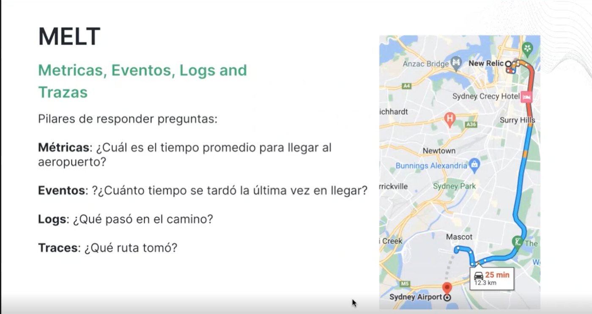

# Observavilidad en microservicios

## MELT

ejemplo



Apuntes

* eventos: datos sin procesar
* metricas: datos agrupados kpi, valores utiles para el negocio


Generaremos un ejemplo de un spotify para aplicar observabilidad a los siguientes puntos de una insfraestructura de microservicios

* Llamados http desde un cliente a un BFF
* Llamados http desde microservicio a microservicio
* Llamado a base de datos
* Mensaje a una cola y escucha de mensajes


servicios
* player-bff: recibira las peticiones del usuario y hara llamados a los microservicios y devolvera las respuestas adecuadas. este actuara como un facade. tendra las siguientes operaciones:
    * search-songs: busca canciones y devuelve la respuesta al cliente
    * get-recomendation: enviara una peticion de recomendacion a una cola
    * on-recomendations: escuchara las recomendaciones recibidas mediante una cola
* songs-ms: api de busqueda de canciones por titulo, genre, y artist la estructira de datos solo sera una tabal o coleccion
* ai-recomendation-ms: recibira una cancion o artista o genre y generara una playlist de tamaño 10, esta api hara una peticion a OPEN AI o Fake y devolvera la lista
 

```text
client rest -->  BFF-player (http-server) --GET->    |song-ms
client rest <--  BFF-player (http-server) <-200 OK-- |song-ms

```